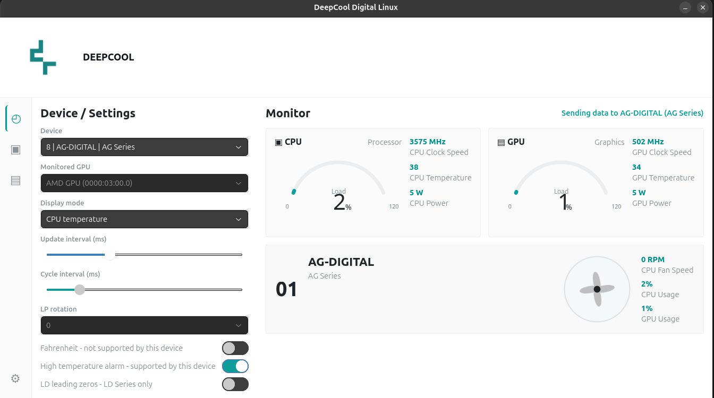
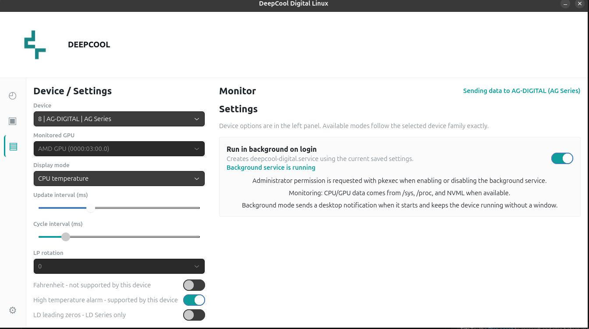

# DeepCool Digital Linux

Unofficial GTK control panel for DeepCool Digital USB/HID devices on Linux.

It shows CPU/GPU data, sends display data to supported devices, and can run in the background with
`deepcool-digital.service`.

> This project is not affiliated with DeepCool.

## Build

```sh
make
```

## Install

```sh
./deepcool-digital-linux --install
```

This installs the app into `~/.local/bin` and adds the desktop launcher/icon.

Run it from your application menu after installing. The app asks for administrator permission when
needed because HID access usually requires root privileges.

## Uninstall

```sh
~/.local/bin/deepcool-digital-linux --uninstall
```

This also disables and removes `deepcool-digital.service`.

## Dependencies

### Debian/Ubuntu

```sh
sudo apt install build-essential pkg-config libgtk-4-dev libhidapi-dev libglib2.0-dev-bin policykit-1
```

### Fedora

```sh
sudo dnf install gcc make pkgconf-pkg-config gtk4-devel hidapi-devel glib2-devel polkit
```

### Arch

```sh
sudo pacman -S base-devel pkgconf gtk4 hidapi glib2 polkit
```

## Notes

- Background mode uses `deepcool-digital.service`.
- The tray icon requires StatusNotifier/AppIndicator support in your desktop environment.
- For GNOME, you may need an AppIndicator/KStatusNotifierItem extension.

## Screenshots




